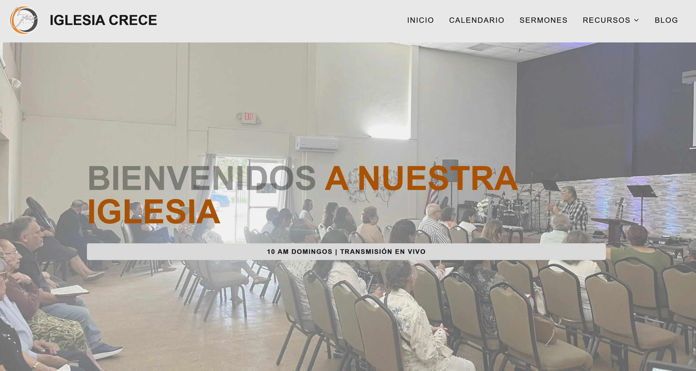

<!-- BACK TO TOP -->
<a id="readme-top"></a>

# Crece Church Website

[](https://astro.build)
[](https://starlight.astro.build)
[](https://opensource.org/licenses/MIT)

Crece Church's website is a high‑performance, customizable website built with [**Astro**](https://astro.build/). It prioritizes speed, ease of use, and robust sermon organization.

---

## 🌐 Demo

<div align="center">

[](https://crece-site.crecechurch.workers.dev/)



</div>

<p align="right">(<a href="#readme-top">back to top</a>)</p>

---

## ✨ Key Features

- 🧠 **Low‑Code Configuration** — Most settings are controlled through a single configuration file.  
  *(User login coming soon!)*  
  Some features are based on this [Astro guide](https://docs-astro-church.netlify.app/guides/low-code-setup/).
- 🎨 **Themeable** — Easily adjust colors and branding.
- 📝 **Markdown‑Based Content** — Sermons, blog posts, and pages are stored as Markdown files.
- 📅 **Google Calendar Integration** — Automatically sync church events.
- 📧 **Newsletter Ready** — Built‑in subscription form powered by Resend.
- 📰 **Integrated Blog** — Publish devotionals, updates, and announcements.
- 📄 **Custom Pages** — Add “About Us,” “Leadership,” “Beliefs,” “Location,” and more.

<p align="right">(<a href="#readme-top">back to top</a>)</p>

---

## 🎙️ Sermon Management

A powerful sermon library system:

- 🔍 **Smart Search** — Search by title or scripture reference.
- 🎚️ **Dynamic Filtering** — Filter by series or preacher.
- 🎧 **Multi‑Platform Embedding** — Embed audio or video from Spotify, YouTube, and more.

<p align="right">(<a href="#readme-top">back to top</a>)</p>

---

## 🚀 Quick Start

1. Create a new project

```bash
pnpm create astro@latest -- --template crecechurch/crece-site
```

2. Configure your site

```bash
cp .env.example .env
# Edit .env with your information
```

3. Start development server

```bash
pnpm dev
```

Your site will be available at: [http://localhost:4321](http://localhost:4321)

<p align="right">(<a href="#readme-top">back to top</a>)</p>

---

## 📚 Documentation

Documentation is available at:  
👉 [Astro Church Docs](https://docs-astro-church.netlify.app)

> Note: Some features may differ from the original Astro Church Docs depending on customizations made for Crece Church.

<p align="right">(<a href="#readme-top">back to top</a>)</p>

---

## 🛠️ Tech Stack

- 
- 
- 
- 
- 
- 
- 

<p align="right">(<a href="#readme-top">back to top</a>)</p>

---

<!-- CONTRIBUTING -->

## 🤝 Contributing

We welcome contributions from volunteers and developers.

If you have a suggestion that would make this better, please open an issue or create a pull request.
Don’t forget to give the project a star — thank you!

How to contribute:

```bash
# 1. Fork the project
# (Click the "Fork" button at the top-right of the GitHub repo)

# 2. Clone your fork
git clone https://github.com/<your-username>/crece-site.git
cd crece-site

# 3. Create your feature branch
git checkout -b feature/my-update

# 4. Make your changes, then commit them
git add .
git commit -m "Describe your change"

# 5. Push your branch to your fork
git push origin feature/my-update

# 6. Open a Pull Request
# (Go to your fork on GitHub → "Compare & pull request")

```

Thank you for helping improve the Crece Church website!

<p align="right">(<a href="#readme-top">back to top</a>)</p>

---

## 📄 License

This project is licensed under the MIT License.

<p align="right">(<a href="#readme-top">back to top</a>)</p>
